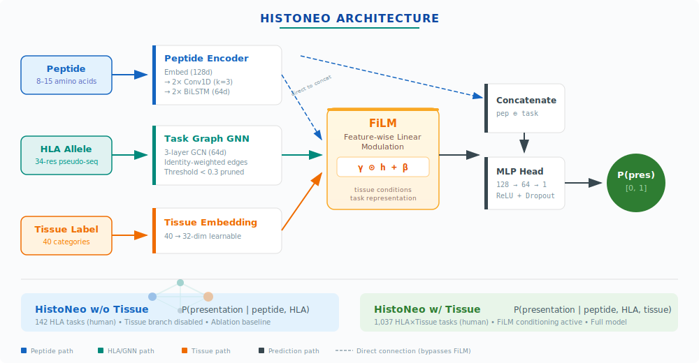

# HistoNeo

**基于图神经网络与特征线性调制（FiLM）的组织特异性 HLA-I 抗原呈递预测**

> 一个面向癌症免疫治疗新抗原发现的深度学习框架，通过引入组织上下文信息以提升 MHC-I 抗原呈递预测性能。

---

## 项目简介

HistoNeo 是西交利物浦大学（XJTLU）博士研究课题的配套代码库，核心问题是：在 HLA 等位基因信息之外，额外引入**组织上下文**是否能有效提升 MHC-I 肽段呈递预测的准确性——这是个性化癌症疫苗设计中的关键瓶颈。

核心假设是：抗原呈递不仅由 HLA 等位基因决定，也受到组织微环境的影响（蛋白酶体组成、TAP 表达、组织特异性分子伴侣等因素因组织而异）。HistoNeo 通过以下两种配置的对照实验加以验证：

| 配置 | 任务定义 | 描述 |
|------|---------|------|
| **HistoNeo w/o Tissue** | 仅 HLA | 消融基线：仅基于 HLA 等位基因进行呈递预测（142 个任务） |
| **HistoNeo w/ Tissue** | HLA × Tissue | 完整模型：同时基于 HLA 等位基因和组织类型进行预测（1,037 个任务） |

HistoNeo w/ Tissue 以**图神经网络（GNN）**为骨干，配合**FiLM（Feature-wise Linear Modulation）**层，使组织嵌入向量能够动态调制 HLA 特异性的任务表示。

---

## 主要结果

在 IEDB 免疫肽组学留出测试集上（人类，142 个 HLA-I 等位基因，40 个组织类别）：

| 模型 | AUROC | σ(AUROC) | F1 | AUPRC |
|:-----|:-----:|:--------:|:--:|:-----:|
| **HistoNeo w/ Tissue** | **0.9874** | **0.0220** | 0.8084† | — |
| MHCflurry 2.0 | 0.9785 | 0.0459 | 0.8264 | — |
| HistoNeo w/o Tissue | 0.9778 | 0.0347 | 0.7449 | — |
| MixMHCpred 3.0 | 0.9677 | 0.0520 | 0.7598 | — |
| NetMHCpan 4.2c | 0.9645 | 0.0477 | 0.7629 | 0.8968 |

> † w/ Tissue 的 F1 在 1,037 个 HLA×Tissue 任务上评估；其他 F1 在 142 个 HLA-only 任务上评估。AUROC 和 σ(AUROC) 为主要对比指标。

**核心发现**：
- HistoNeo w/ Tissue 相比 w/o Tissue，F1 提升 **+8.52%**，AUROC 方差降低 **36.6%**
- 在**训练样本稀少的罕见任务**上增益更为显著，说明组织条件化在数据匮乏时能提供有效的归纳偏置
- 小鼠跨物种验证（18 个 MHC 等位基因，26 个组织）同样观察到 **+7.9% AUROC 增益**，证实组织信号的生物学普遍性

---

## 模型架构

<p align="center">
  
</p>

三阶段流水线（肽段编码器 → 任务 GNN → 预测器）在两种配置间共享。w/ Tissue 额外引入轻量级的组织 FiLM 分支，参数量增加约 5–10%。

### 组件说明

| 组件 | 结构 | 说明 |
|:-----|:-----|:-----|
| **Peptide Encoder** | Embed (128d) → 2×Conv1D (k=3) → 2×BiLSTM (64d) → Linear | 提取肽段序列的局部 motif 与全局上下文特征 |
| **Task Graph GNN** | 3-layer GCN, 64-dim per layer, dropout=0.3 | 在伪序列相似度图上传播任务表示，实现数据稀缺任务的知识迁移 |
| **Tissue Embedding** | 40 类 → 32-dim learnable lookup | 将组织类别映射为稠密向量 |
| **FiLM** | γ = Linear(tissue), β = Linear(tissue); output = γ ⊙ h + β | 通过逐元素缩放与偏移，使任务表示适应组织上下文 |
| **Prediction Head** | MLP (128→64→1), ReLU + Dropout + Sigmoid | 输入 [peptide_repr ⊕ task_repr]，输出呈递概率 |

---

## 数据集

| 物种 | 等位基因 | 组织 | 独立肽段 | 肽段–等位基因对 | 正样本数 |
|:-----|:-------:|:---:|:-------:|:-------------:|:-------:|
| 人类 | 142 | 40 | 342,934 | 545,391 | 851,365 |
| 小鼠 | 18 | 26 | 48,450 | 69,294 | 109,804 |

- **数据来源**：IEDB 质谱免疫肽组学数据
- **肽段长度**：8–15 残基（人类数据中 9-mer 占 60.8%）
- **数据划分**：80 / 10 / 10（训练 / 验证 / 测试），按 HLA×Tissue 组合分层
- **负样本比例**：10:1（阴性:阳性），基于来源蛋白配对切割动态生成

---

## 仓库结构

```
HistoNeo/
├── configs/
│   └── hla_sequences.json              # HLA 伪序列（34 aa，NetMHCpan 格式）
│
├── data/
│   ├── Cleaned_data.py                 # IEDB 原始数据清洗（人类，Homo sapiens）
│   ├── Cleaned_data_mouse.py           # IEDB 原始数据清洗（小鼠，Mus musculus）
│   ├── preprocess_data.py              # 清洗结果整合，输出标准 TSV
│   ├── data_statistics.py              # 清洗结果统计分析
│   ├── human_proteome.fasta            # UniProt 人类蛋白质组（用于负样本采样）
│   └── negative_samples/               # 负样本缓存
│
├── scripts/
│   ├── train_mode2.py                  # 端到端训练：HistoNeo w/ Tissue
│   ├── train_mode1.py                  # 端到端训练：HistoNeo w/o Tissue（独立）
│   ├── train_mode1_with_mode2_splits.py  # 在 w/ Tissue 划分上重训 w/o Tissue（公平消融对比）
│   ├── evaluate_per_task.py            # 逐任务评估（w/ Tissue，含 tissue 分层）
│   ├── evaluate_mode1_simple.py        # 逐任务评估（w/o Tissue）
│   ├── evaluate_mode2_simple.py        # 逐任务评估（w/ Tissue，含 tissue 汇总）
│   ├── evaluate_mixmhcpred.py          # 基线：MixMHCpred 3.0
│   ├── evaluate_mhcflurry.py           # 基线：MHCflurry 2.0
│   └── evaluate_netmhcpan.py           # 基线：NetMHCpan 4.2c
│
├── src/
│   ├── config/
│   │   └── mode_config.py              # ModeConfig 数据类；create_mode1/2_config()
│   │
│   ├── data/
│   │   ├── task_definition.py          # Task / TaskManager 类
│   │   ├── unified_task_creator.py     # 创建 HLA-only 或 HLA×Tissue 任务集
│   │   ├── enhanced_negative_sampler.py  # 来源蛋白配对切割负样本生成
│   │   └── dataset.py                  # PyTorch Dataset（模式感知）
│   │
│   ├── models/
│   │   ├── full_model.py               # ImmuneAppModel：FiLM 融合，模式感知前向传播
│   │   ├── peptide_encoder.py          # CNN + BiLSTM 肽段编码器
│   │   ├── task_gnn.py                 # HLA 任务图 GCN
│   │   └── predictor.py               # 任务条件化 MLP 预测器
│   │
│   ├── graph/
│   │   └── task_graph.py              # HLA 伪序列一致性图构建
│   │
│   ├── training/
│   │   ├── unified_trainer.py         # 主训练循环（标准 + 自适应任务均衡采样）
│   │   ├── per_task_evaluator.py      # 逐任务指标，tissue 分层汇总
│   │   └── maml.py                    # MAML 训练器（已评估，当前未启用）
│   │
│   └── docs/
│       └── MIGRATION_GUIDE.md         # 代码迁移说明
│
└── README.md
```

---

## 安装

**环境要求**：Python ≥ 3.9，PyTorch ≥ 2.0，CUDA 11.8+

```bash
# 克隆仓库
git clone https://github.com/<your-username>/HistoNeo.git
cd HistoNeo

# 创建虚拟环境
python -m venv venv
source venv/bin/activate

# 安装依赖
pip install torch==2.0.1 --index-url https://download.pytorch.org/whl/cu118
pip install torch-geometric
pip install pandas numpy scikit-learn biopython tqdm
```

### 数据准备

1. **IEDB 免疫肽组学数据** — 从 [https://www.iedb.org](https://www.iedb.org) 下载 `mhc_ligand_full.csv`，放入 `data/` 目录。
2. **人类蛋白质组 FASTA** — 从 [UniProt](https://www.uniprot.org/proteomes/UP000005640)（物种 ID 9606）下载，保存为 `data/human_proteome.fasta`。
3. **HLA 伪序列** — 已提供于 `configs/hla_sequences.json`（34 残基，NetMHCpan 格式）。

如需进行**小鼠实验**，请从 UniProt（物种 ID 10090）下载 *Mus musculus* 蛋白质组，保存为 `data/mouse_proteome.fasta`。

---

## 使用方法

### 第一步 — 原始数据清洗

IEDB 原始数据为多列两级表头的大型 CSV 文件，需先分块清洗。**人类数据**运行：

```bash
python data/Cleaned_data.py
```

默认读取当前目录下的 `mhc_ligand_full_*.csv` 分块文件，过滤 *Homo sapiens* 条目，仅保留符合 `HLA-[ABC]*dd:dd` 格式的 MHC-I 限制性肽段（长度 8–15 aa），从 `Molecule Parent IRI` 中提取 UniProt ID，并按疾病/组织信息推断 `Inferred_Tissue`，结果输出至 `cleaned_data/` 目录（分块 CSV）。

**小鼠数据**流程相同，过滤条件改为 *Mus musculus* 和鼠 MHC-I 格式（`H-?2-[A-Za-z]\w*`）：

```bash
python data/Cleaned_data_mouse.py
```

### 第一步（续）— 统计分析（可选）

```bash
python data/data_statistics.py
```

### 第二步 — 数据整合与格式转换

将清洗后的分块数据整合为训练脚本所需的标准 TSV 格式：

```bash
python data/preprocess_data.py \
    --positive_dir cleaned_data \
    --output_file data/mode2_data.tsv \
    --mode mode2 \
    --tissue_source Inferred_Tissue
```

输出列为 `peptide`、`hla`、`tissue`、`label`，以及用于负样本配对采样的 `UniProt_ID`、`Epitope_Start`、`Epitope_End`。

### 第三步 — 训练 HistoNeo w/ Tissue（完整模型）

```bash
python scripts/train_mode2.py \
    --data_file data/mode2_data.tsv \
    --tissue_source Host \
    --proteome_file data/human_proteome.fasta \
    --output_dir output/mode2_experiment \
    --hla_sequences configs/hla_sequences.json \
    --min_samples 10 \
    --min_samples_for_split 10 \
    --negative_ratio 10 \
    --n_epochs 50 \
    --batch_size 256 \
    --meta_lr 0.001 \
    --graph_threshold 0.3 \
    --save_negative_cache
```

### 第四步 — 训练 HistoNeo w/o Tissue（消融基线）

为确保公平对比，w/o Tissue 在与 w/ Tissue **完全相同的数据划分**上重训：

```bash
python scripts/train_mode1_with_mode2_splits.py \
    --mode2_output_dir output/mode2_experiment \
    --output_dir output/mode1_ablation \
    --proteome_file data/human_proteome.fasta \
    --negative_ratio 10 \
    --n_epochs 50 \
    --batch_size 256 \
    --meta_lr 0.001
```

### 第五步 — 评估

```bash
# 逐任务评估（w/ Tissue，含 tissue 分层）
python scripts/evaluate_per_task.py \
    --checkpoint output/mode2_experiment/best_model.pt \
    --data_file data/mode2_data.tsv \
    --output_dir output/mode2_experiment/evaluation

# 基线对比：MixMHCpred 3.0
python scripts/evaluate_mixmhcpred.py \
    --test_file output/mode2_experiment/data_splits/test.tsv \
    --mode1_output_dir output/mode1_ablation \
    --mixmhcpred_dir /path/to/MixMHCpred \
    --output_dir output/baselines/mixmhcpred \
    --negative_ratio 10 \
    --use_negative_cache

# 基线对比：MHCflurry 2.0
python scripts/evaluate_mhcflurry.py \
    --test_file output/mode2_experiment/data_splits/test.tsv \
    --output_dir output/baselines/mhcflurry \
    --negative_ratio 10
```

### 小鼠模型训练

```bash
python scripts/train_mode2.py \
    --data_file data/mouse_mode2_data.tsv \
    --tissue_source Host \
    --proteome_file data/mouse_proteome.fasta \
    --output_dir output/mouse_mode2 \
    --min_samples 10 \
    --min_samples_for_split 10 \
    --negative_ratio 10 \
    --n_epochs 50 \
    --batch_size 256 \
    --meta_lr 0.001
```

---

## 训练参数

| 参数 | 值 | 说明 |
|:-----|:--:|:-----|
| `min_samples` | 10 | 每个任务最少正样本数 |
| `negative_ratio` | 10 | 阴性:阳性采样比例 |
| `n_epochs` | 50 | 训练轮数 |
| `batch_size` | 256 | 批大小 |
| `meta_lr` | 1×10⁻³ | Adam 学习率 |
| `graph_threshold` | 0.3 | 图边权剪枝阈值 |
| `dropout` | 0.3 | Dropout 比例 |
| GPU | NVIDIA RTX 4090 | 测试硬件 |
| Framework | PyTorch 2.0 + PyG | 深度学习框架 |

---

## 实验设计说明

### 负样本生成

负样本通过**来源蛋白配对切割策略**生成（`EnhancedNegativeSampler`）：对每条正样本（肽段, HLA），从*同一来源蛋白*上随机切取等长片段作为负样本候选，并排除所有已知阳性序列。该策略的估计假阴性率约为 1–3%。

默认负样本比例：**10:1**（阴性:阳性），通过自适应任务均衡采样动态调整任务权重，防止主导任务（如 blood × HLA-A*02:01）垄断训练。

### 数据划分

数据集按 HLA×Tissue 组合分层，以 **80/10/10** 的比例划分为训练/验证/测试集（`random_state=42`）。划分前先过滤正样本数少于 `min_samples_for_split`（默认 10）的组合；划分后，`UnifiedTaskCreator` 再次过滤训练集中正样本不足 `min_samples`（默认 10）的任务。

### 任务定义

- **w/o Tissue 任务**：每个 HLA 等位基因对应一个任务。人类 142 个，小鼠 18 个。
- **w/ Tissue 任务**：每个（HLA 等位基因, 组织类型）组合对应一个任务。人类 1,037 个（训练集过滤后），小鼠 89 个。

### HLA 任务图

HLA 等位基因作为图的节点，边权重由 34 残基伪序列的**位置一致性**计算：

```
sim(i, j) = (1/34) × Σ 𝟙[sₖ⁽ⁱ⁾ = sₖ⁽ʲ⁾]
```

对于 w/ Tissue 图，节点为 HLA×Tissue 组合，边权重为 HLA 相似度（权重 0.7）与组织共现频率（权重 0.3）的加权和。相似度低于 0.3 的边被剪枝。

### MAML 元学习

实验中评估了 MAML（Model-Agnostic Meta-Learning）作为替代训练策略，但标准 Adam 优化器结合 GNN 图拓扑在所有验证指标上持续优于 MAML 初始化，因此最终模型未启用 MAML。

---

## 基线方法

| 方法 | 版本 | 参考文献 |
|:-----|:-----|:---------|
| NetMHCpan | 4.2c | Reynisson et al., *Nucleic Acids Res.* 2020 |
| MHCflurry | 2.0 | O'Donnell et al., *Cell Syst.* 2020 |
| MixMHCpred | 3.0 | Tadros et al., 2025; Gfeller et al., 2023 |

---

## 可复现性

所有实验均可从 IEDB 原始数据完整复现。训练流水线自动保存：

- `data_splits/train.tsv`、`val.tsv`、`test.tsv` — 完整数据划分
- `split_meta.json` — 划分元数据与配置
- `tasks/` — 任务定义与映射
- `best_model.pt` — 最优检查点（验证 AUROC 最高）
- `training_history.json` — 逐 epoch 训练指标

数据划分使用固定随机种子 `random_state=42`。

---

## 引用

如在研究中使用 HistoNeo，请引用：

```bibtex
@article{histoneo2026,
  title   = {HistoNeo: Tissue-Specific Prediction of HLA Class I Peptide
             Presentation via Graph Neural Networks and Feature-wise
             Linear Modulation},
  author  = {Huang, Y. and others},
  year    = {2026},
  note    = {Manuscript in preparation}
}
```

---

## 许可证

本项目基于 MIT 许可证开源。详见 [LICENSE](LICENSE)。
